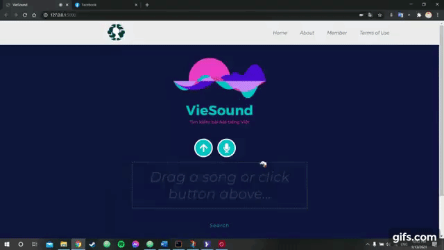
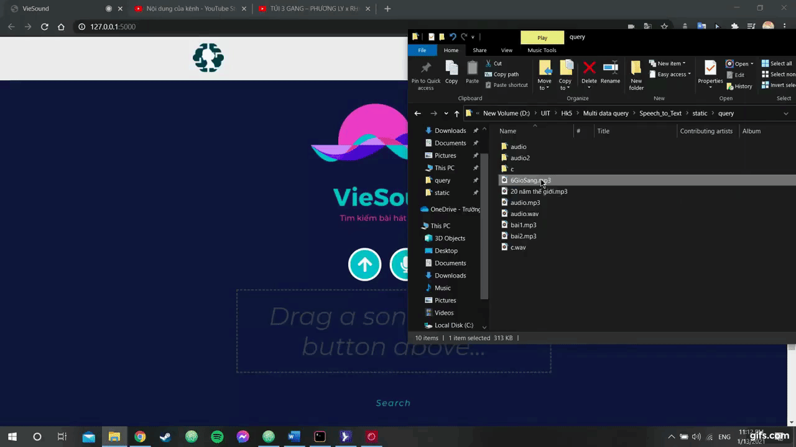

# Truy vấn thông tin đa phương tiện - CS336.L12.KHCL


### Members:
* [Trần Minh Tiến] - 18521492
* Trần Xuân Hưng - 18520286
* Trần Ngọc Chính - 18520534
* Nguyễn Phước Bình - 18520507

### Requires for Window User:

We use Spleeter to split voice from sound, which is a pretrained model deep learning required GPU activate!

* [NVIDIA® GPU drivers](https://www.nvidia.com/download/index.aspx?lang=en-us) — CUDA® 11.0 requires 450.x or higher.
* [CUDA® Toolkit](https://developer.nvidia.com/cuda-toolkit-archive) — TensorFlow supports CUDA® 11 (TensorFlow >= 2.4.0)
* [cuDNN SDK 8.0.4](https://developer.nvidia.com/cudnn)

### Installation:

```sh
$ cd Speech_to_Text
$ virtualenv env
$ source env/Scripts/activate
$ pip install -r requirements.txt
```

### Usage:

Web app using flask as backend, I use default port:

```sh
http://127.0.0.1:5000/
```

To run web app, use this:
```sh
$ python app.py
```

To crawl data, use this:
```sh
$ python ./Music/Crawler/crawler.py
```

To check accuracy, use this:
```sh
$ python accuracy.py
```

### Demo1: https://youtu.be/V_HZi6CDHRs

[](https://youtu.be/V_HZi6CDHRs)

### Demo2: https://youtu.be/9RoBEYkMOd4

[](https://youtu.be/9RoBEYkMOd4)

[Trần Minh Tiến]: <https://github.com/fantashi099>
